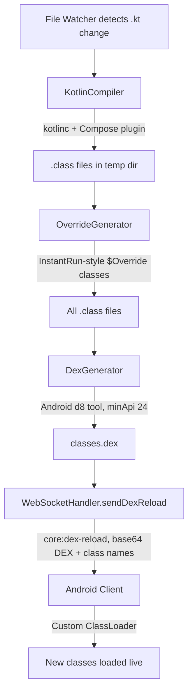

# Hot Reload System

JetStart's hot reload system bypasses the Gradle build process entirely for code changes. Rather than recompiling and repackaging the entire app, it compiles only the changed Kotlin file to DEX bytecode and loads it directly into the running Android process — no reinstall, no Activity restart.

## How It Actually Works



The entire pipeline — from file save to classes running on the device — completes in under 100ms on a local network.

## Pipeline Stages

### 1. File Watcher

`FileWatcher` uses **chokidar** to monitor the project tree with a 300ms debounce. It watches:

- `**/*.kt` — Kotlin source files
- `**/*.xml` — Layout and resource files
- `**/*.gradle` / `**/*.gradle.kts` — Build configuration

Changes to non-Kotlin files (resources, Gradle) fall back to a full Gradle build. Changes to `.kt` files enter the hot reload pipeline.

### 2. KotlinCompiler

`KotlinCompiler` invokes `kotlinc` as a child process to compile the changed file to JVM `.class` files.

**Classpath construction** (done once, cached statically):
- `android.jar` from `$ANDROID_HOME/platforms/<latest>`
- All JARs matching required groups in `~/.gradle/caches/modules-2/files-2.1/` (Compose runtime, AndroidX, Kotlin stdlib, etc.)
- All `classes.jar` entries from `~/.gradle/caches/transforms-3/`
- Project build outputs (`app/build/tmp/kotlin-classes/debug`, R.jar) — always fetched fresh

**Compose compiler plugin:** On Kotlin 2.0+ the bundled plugin at `<kotlinc>/lib/compose-compiler-plugin.jar` is used. For older versions it falls back to the version in the Gradle module cache.

**Windows compatibility:** Arguments are written to a temp `@argfile` to avoid command-line length limits.

### 3. OverrideGenerator

Implements the **InstantRun `$Override` pattern** — for each modified class, a companion `$Override` class is generated that carries the new method implementations. The Android runtime's hot swap mechanism can apply these at the method level without reloading the entire class hierarchy.

If override generation fails for any class, it falls back to direct class replacement (slightly less efficient but still correct).

### 4. DexGenerator

Invokes Android's **`d8`** tool (from `$ANDROID_HOME/build-tools/<latest>`) to convert all `.class` files — including the `$Override` companions — to a single `classes.dex`.

```
d8 --output <tmpDir> --min-api 24 <class files...>
```

The resulting DEX file is read into a `Buffer` and base64-encoded for WebSocket transmission.

### 5. WebSocket Dispatch

`WebSocketHandler.sendDexReload()` broadcasts the `core:dex-reload` message to all authenticated Android clients in the current session:

```json
{
  "type": "core:dex-reload",
  "timestamp": 1711900000000,
  "sessionId": "a1b2c3",
  "dexBase64": "<base64-encoded classes.dex>",
  "classNames": ["com.example.app.MainActivity", "com.example.app.MainActivity$Override"]
}
```

### 6. Android Runtime
 
 The Android client receives the DEX payload, decodes it, and loads the new classes via a custom `ClassLoader`. The running Activity recompositions with the updated code — no restart required.
 
-**Implementation Details:**
-- **[`IncrementalChange.java`](../../packages/template/base/app/src/main/java/com/jetstart/hotreload/IncrementalChange.java)**: The core interface for class instrumentation.
-- **[`JetStart.kt`](../../packages/template/base/app/src/main/java/__PACKAGE_PATH__/JetStart.kt)**: The hot-reload engine, WebSocket client, and custom `HotReloadClassLoader`.
+**Core Implementation Files:**
+To keep the client lightweight, these core engine files are bundled directly in the template:
+- **`IncrementalChange.java`**: The interface that all instrumented classes use to dispatch method calls to updated code. **Do not move or rename this file.**
+- **`JetStart.kt`**: Contains the `HotReload` manager, `DSLInterpreter`, and the `HotReloadClassLoader` responsible for child-first class loading. **Do not edit this file unless you are extending JetStart itself.**

## Web Emulator Path

For the browser-based web emulator, a parallel pipeline runs alongside:

```
Changed .kt file
  → kotlinc-js  (Kotlin/JS compiler)
  → ES module (.mjs)
  → base64-encode
  → core:js-update broadcast
  → Browser: dynamic import()
  → ComposeRenderer re-renders the UI
```

Both pipelines fire simultaneously on the same file change. Android devices receive `core:dex-reload`; browser clients receive `core:js-update` and can ignore the DEX message.

## DSL System

A separate **DSL layer** exists in `@jetstart/web` for the browser emulator's visual preview. The DSL is a JSON representation of Compose UI structure (Column, Row, Text, Button etc.) and is used by the web emulator's `DSLRenderer` components to paint a Material You HTML preview when a full JS module is not yet available.

The DSL does **not** drive hot reload on Android devices. Real Android hot reload is always DEX-based.

## Fallback: Full Gradle Build

When hot reload is not viable, `GradleExecutor` runs a full `assembleDebug` build:

- Resource file changes (`.xml`, drawables, strings)
- `build.gradle` / `settings.gradle` changes
- New imports or dependency additions
- Any `.kt` file that fails `kotlinc` compilation

The build uses system Gradle if available (faster), otherwise falls back to the project `gradlew` wrapper. On success, `core:build-complete` is broadcast with the APK download URL.

## Timing

| Step | Typical Duration |
|---|---|
| Change detection (chokidar) | 5 – 15 ms |
| kotlinc compilation (single file) | 30 – 60 ms |
| Override class generation | 5 – 15 ms |
| d8 DEX conversion | 10 – 20 ms |
| WebSocket transmission (LAN) | 2 – 5 ms |
| Android ClassLoader + recomposition | 10 – 20 ms |
| **Total** | **62 – 135 ms** |

## Environment Requirements

| Tool | Where it comes from |
|---|---|
| `kotlinc` | `$KOTLIN_HOME/bin/kotlinc`, Android Studio plugins, or system PATH |
| Compose compiler plugin | Bundled in Kotlin 2.0+, or `~/.gradle` cache for older versions |
| `d8` | `$ANDROID_HOME/build-tools/<version>/d8` |
| Android SDK classpath | `$ANDROID_HOME/platforms/<version>/android.jar` |

Run `HotReloadService.checkEnvironment()` to verify all tools are present before starting a session:

```typescript
const { ready, issues } = await hotReloadService.checkEnvironment();
if (!ready) {
  issues.forEach(i => console.error(i));
}
```

## Limitations

Hot reload applies changes live for:
- ✅ `@Composable` function bodies
- ✅ UI structure (layouts, text, colors, modifiers)
- ✅ Any class whose source file can be compiled in isolation

It falls back to a full Gradle build for:
- ❌ New dependencies or changed `build.gradle`
- ❌ Resource file changes
- ❌ `AndroidManifest.xml` changes
- ❌ Files that fail independent compilation (unresolved external references)

