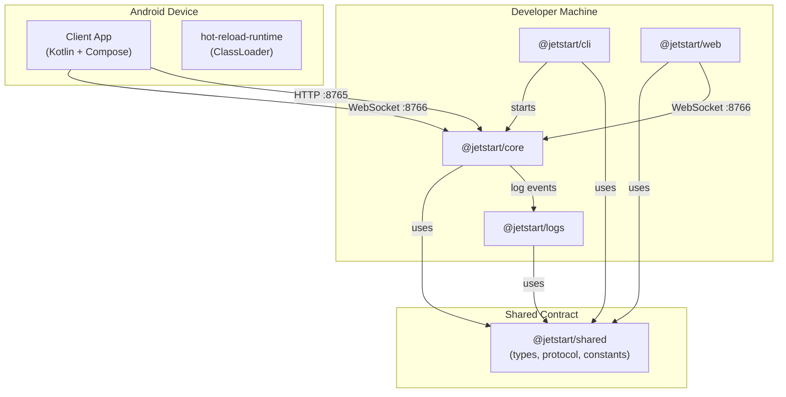
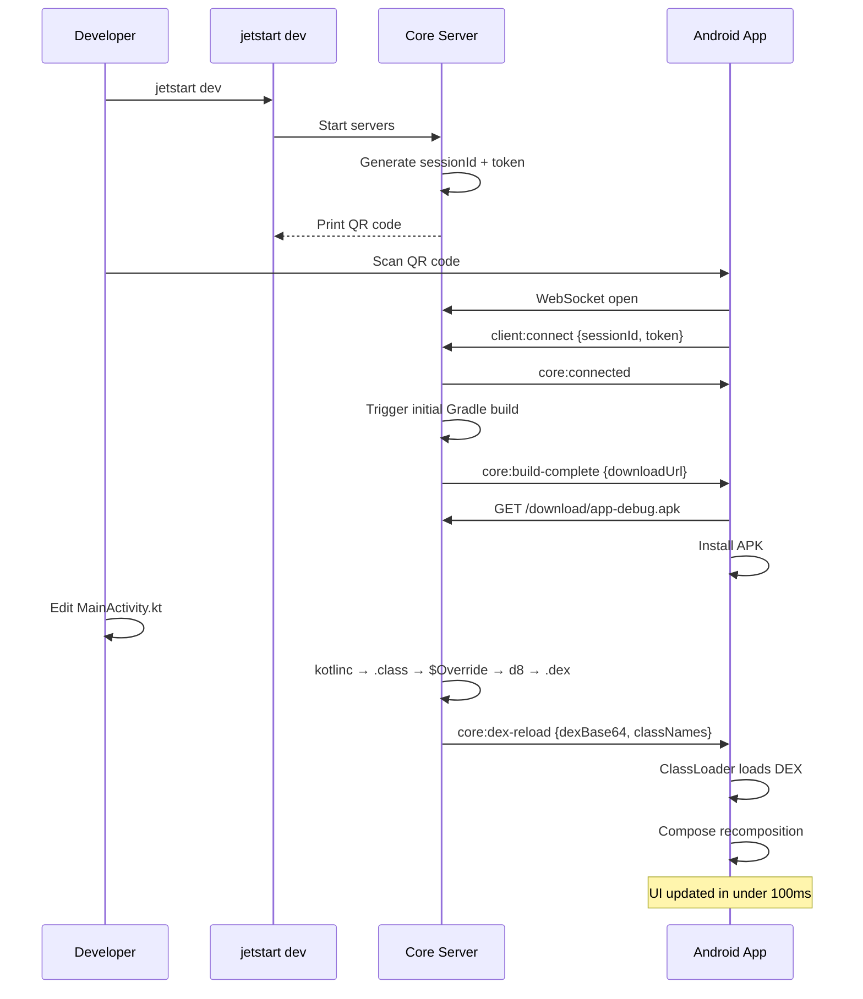

---
title: Overview
description: High-level architecture of the JetStart system
---

# Architecture Overview

JetStart is a modular monorepo of TypeScript and Kotlin packages that work together to deliver instant hot reload for Android Jetpack Compose.

## System Architecture



## Core Components

### @jetstart/cli

The `jetstart` command-line tool. Developers interact with JetStart entirely through this package.

- Project creation and scaffolding (`jetstart create`)
- Starting the development server (`jetstart dev`)
- Building APKs with release security hardening (`jetstart build`)
- Streaming live device logs (`jetstart logs`)
- Android emulator management (`jetstart android-emulator`)
- Environment dependency auditing (`jetstart install-audit`)

### @jetstart/core

The server that does the real work. Runs three networked services and owns the entire hot reload pipeline.

**Servers:**

| Service | Port | Purpose |
|---|---|---|
| HTTP (Express) | `8765` | REST API, APK downloads, web emulator redirect |
| WebSocket | `8766` | Real-time comms with devices and browser |
| (Logs delegated to @jetstart/logs) | `8767` | Log aggregation |

**Hot reload pipeline:**
```
File change (chokidar)
  → KotlinCompiler  (kotlinc + Compose plugin → .class files)
  → OverrideGenerator  ($Override companion classes, InstantRun-style)
  → DexGenerator  (d8 → classes.dex, minApi 24)
  → WebSocketHandler.sendDexReload()  (core:dex-reload to all Android clients)
```

### @jetstart/shared

Single source of truth for all TypeScript types, the WebSocket protocol definition, validation helpers, and constants. Every other TypeScript package imports from here.

### @jetstart/web

React + Vite web emulator hosted at `https://web.jetstart.site`. Auto-opened when the HTTP server redirects `http://localhost:8765`. Receives `core:js-update` (compiled Kotlin/JS ES module) and renders a live Compose UI preview in the browser.

### @jetstart/logs

Standalone WebSocket log server on port `8767`. Maintains an in-memory ring buffer of up to 10,000 log entries. The `jetstart logs` CLI command connects here to stream logs to the terminal.

### Client App (Android)

The Kotlin/Compose companion app. Scans the QR code, authenticates with the session token, triggers the initial build, downloads and installs the APK, and then loads incoming DEX patches via `hot-reload-runtime` for all subsequent changes.

## Hot Reload Data Flow



## Communication Protocols

### HTTP (port 8765)

| Endpoint | Purpose |
|---|---|
| `GET /` | Redirects to web emulator with session params |
| `GET /health` | Health check |
| `GET /version` | Server version |
| `POST /session/create` | Create session + QR code |
| `GET /session/:id` | Get session info |
| `GET /download/:filename` | Download built APK |

### WebSocket (port 8766)

Key message types:

| Direction | Type | Purpose |
|---|---|---|
| Client → Core | `client:connect` | Auth with sessionId + token |
| Client → Core | `client:log` | Forward device logs |
| Client → Core | `client:heartbeat` | Keep-alive (every 30s) |
| Core → Client | `core:connected` | Auth confirmed |
| Core → Client | `core:build-complete` | APK ready with download URL |
| Core → Client | `core:dex-reload` | Hot reload: base64 DEX + class names |
| Core → Client | `core:js-update` | Web emulator: base64 ES module |

See [WebSocket Protocol](./websocket-protocol.md) for the complete specification.

## Package Dependencies

```
@jetstart/cli  ──► @jetstart/core ──► @jetstart/shared
@jetstart/web  ─────────────────────► @jetstart/shared
@jetstart/logs ─────────────────────► @jetstart/shared

packages/client          (Kotlin — no npm deps, implements WS protocol independently)
packages/gradle-plugin   (Kotlin — no npm deps)
packages/hot-reload-runtime (Kotlin — the ClassLoader used by the client app)
```

## Security Model

**Session tokens** — Every `jetstart dev` run generates a fresh `sessionId` and `token`. Both are embedded in the QR code. Any device presenting the wrong `sessionId` is closed immediately with WebSocket code `4001`; wrong `token` with `4002`. A device built during a previous session cannot reconnect to a new one — the user must rescan the QR.

**Release builds** — `jetstart build --release` strips the dev-server URL and session token from `BuildConfig` before compiling, and restores `build.gradle` to its original state even if the build fails. No dev credentials appear in production binaries.

## Performance

| Operation | Typical time |
|---|---|
| Hot reload (Kotlin → DEX → device) | 62 – 135 ms |
| Initial Gradle debug build (incremental) | 10 – 30 s |
| Initial Gradle debug build (clean) | 30 – 60 s |
| APK download over local Wi-Fi | 500 ms – 2 s |

## Related Documentation

- [Hot Reload System](./hot-reload-system.md) — full pipeline details
- [Build System](./build-system.md) — Gradle build and ADB integration
- [WebSocket Protocol](./websocket-protocol.md) — complete message specification
- [Session Management](./session-management.md) — session lifecycle
- [Package Structure](./package-structure.md) — detailed monorepo layout

