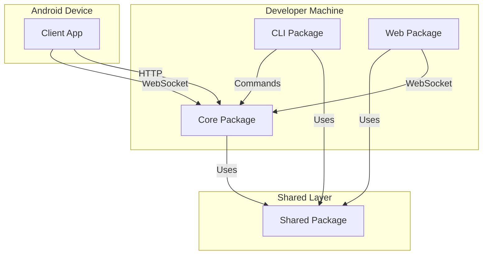
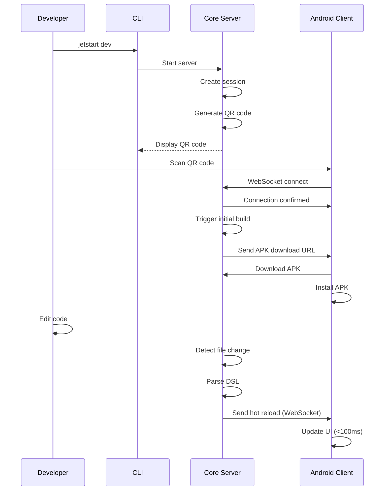
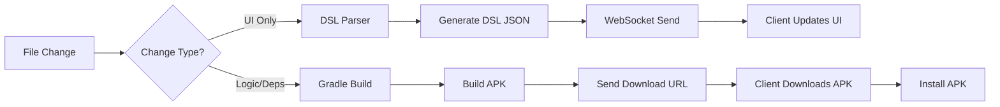

# Architecture Overview

JetStart is built as a modular system with multiple packages working together to provide fast Android development with hot reload capabilities.

## System Architecture

JetStart follows a client-server architecture with the following components:



## Core Components

### 1. CLI Package (`@jetstart/cli`)

The command-line interface that developers interact with.

**Responsibilities:**
- Project creation and scaffolding
- Starting development servers
- Building APKs
- Managing Android emulators
- Environment auditing

**Key Features:**
- User-friendly command interface
- Dependency management
- Project template generation

### 2. Core Package (`@jetstart/core`)

The central server that orchestrates all development activities.

**Responsibilities:**
- HTTP server (serves APKs and REST API)
- WebSocket server (real-time communication)
- Build management (Gradle integration)
- Session management (device pairing)
- File watching (auto-rebuild)
- DSL parsing (hot reload)

**Key Features:**
- Express HTTP server
- WebSocket communication
- Gradle build orchestration
- QR code generation
- Build caching

### 3. Shared Package (`@jetstart/shared`)

Common code shared across all packages.

**Responsibilities:**
- Type definitions (TypeScript interfaces)
- Protocol definitions (WebSocket messages)
- Validation functions
- Constants (ports, versions)

**Key Features:**
- Type-safe communication
- Consistent protocols
- Shared utilities

### 4. Client Package (Android App)

The Android mobile application that runs on devices.

**Responsibilities:**
- QR code scanning
- WebSocket connection to Core
- APK download and installation
- Hot reload UI updates
- Log streaming

**Key Features:**
- Jetpack Compose UI
- Camera-based QR scanning
- WebSocket client
- APK installer

### 5. Web Package (`@jetstart/web`)

Browser-based development interface (optional).

**Responsibilities:**
- Web-based emulator
- Build monitoring
- Log viewing
- Connection management

**Key Features:**
- React-based UI
- WebSocket client
- Real-time updates

## Data Flow

### Development Workflow



### Hot Reload Flow



## Communication Protocols

### HTTP (REST API)

Used for:
- APK file downloads
- Session management
- Health checks
- Server status

**Default Port:** 8765

### WebSocket

Used for:
- Real-time hot reload updates
- Build status updates
- Log streaming
- Connection management

**Default Port:** 8766

**Message Types:**
- `client:connect` - Client connection request
- `core:build-complete` - Build finished notification
- `core:reload` - Hot reload DSL data
- `client:heartbeat` - Keep-alive ping

See [WebSocket Protocol](./websocket-protocol.md) for details.

## Package Dependencies

```
CLI ──┐
      ├──> Shared
Core ─┤
      │
Web ──┘

Client (Android) - No dependencies on other packages
                   Implements shared protocols
```

**Dependency Graph:**
- CLI depends on Core and Shared
- Core depends on Shared
- Web depends on Shared
- Client is independent (implements protocols)

## Build Process

1. **File Change Detected**
   - Core watches project files using chokidar
   - Detects changes to Kotlin/Compose files

2. **Change Analysis**
   - DSL Parser analyzes if change is UI-only
   - Determines if hot reload is possible

3. **Hot Reload Path** (UI changes)
   - Parse Kotlin to DSL JSON
   - Send via WebSocket to clients
   - Clients update UI instantly

4. **Full Build Path** (logic/dependencies)
   - Trigger Gradle build
   - Compile Kotlin code
   - Package APK
   - Send download URL to clients
   - Clients download and install

## Session Management

Sessions provide secure pairing between clients and the dev server:

1. **Session Creation**
   - Core creates session with unique ID and token
   - Session stored in memory
   - QR code generated with session data

2. **Client Connection**
   - Client scans QR code or enters session details
   - WebSocket connection authenticated with session token
   - Connection linked to session

3. **Session Lifecycle**
   - Sessions expire after 1 hour of inactivity
   - Sessions cleaned up on server restart
   - Multiple clients can connect to same session

## File Structure

```
jetstart/
├── packages/
│   ├── shared/          # Shared types and protocols
│   ├── core/           # Build server
│   ├── cli/            # Command-line interface
│   ├── client/         # Android app
│   └── web/            # Web interface
├── docs/               # Documentation
└── .github/            # CI/CD workflows
```

## Technology Stack

**Backend (Core/CLI/Web/Shared):**
- TypeScript
- Node.js 18+
- Express (HTTP server)
- WebSocket (real-time)
- Chokidar (file watching)
- Gradle (Android builds)

**Client (Android):**
- Kotlin
- Jetpack Compose
- OkHttp (HTTP client)
- WebSocket client
- ML Kit (QR scanning)

**Web:**
- React 18
- TypeScript
- Vite
- WebSocket API

## Scalability Considerations

**Current Design:**
- Single Core server instance per project
- Multiple clients can connect to one session
- Sessions stored in memory (not persistent)

**Future Improvements:**
- Persistent session storage
- Multiple server instances
- Load balancing
- Cloud-based Core servers

## Security

**Session Security:**
- Short-lived tokens (1 hour expiry)
- Session IDs not guessable
- Tokens required for WebSocket connection

**Network Security:**
- Local network only (not exposed to internet)
- QR codes contain local IPs
- No authentication for local development (by design)

**Future Enhancements:**
- TLS/SSL support
- Token refresh mechanism
- Rate limiting

## Performance

**Hot Reload:**
- `<100ms` for UI updates
- DSL parsing: ~10-50ms
- WebSocket transmission: ~5-10ms

**Full Builds:**
- Gradle incremental builds: 10-30s
- Clean builds: 30-60s
- APK download: 500ms-2s (depends on size)

**Optimizations:**
- Build caching (Gradle)
- Incremental compilation
- DSL parsing cache
- WebSocket message compression (future)

## Related Documentation

- [Hot Reload System](./hot-reload-system.md) - Hot reload mechanism details
- [Build System](./build-system.md) - Build process details
- [WebSocket Protocol](./websocket-protocol.md) - Communication protocol
- [Session Management](./session-management.md) - Session lifecycle
- [Package Structure](./package-structure.md) - Detailed package structure
