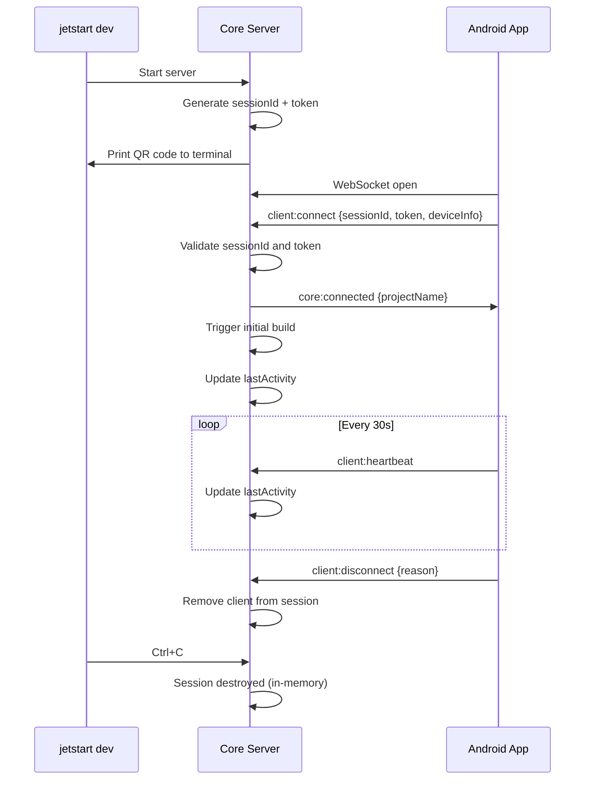

---
title: Session Management
description: How JetStart securely pairs devices with a development server
---

# Session Management

Every `jetstart dev` invocation creates a new, ephemeral session. Sessions are the security boundary that prevents devices built against an old server from connecting to the current one — and they are what the QR code encodes.

## What a Session Is

A session is an in-memory record created when `jetstart dev` starts:

```typescript
interface ServerSession {
  id: string;          // Short alphanumeric ID (embedded in QR code)
  token: string;       // Auth token (embedded in QR code)
  projectName: string;
  projectPath: string;
  createdAt: number;   // Unix ms
  lastActivity: number;
}
```

The `id` and `token` are generated fresh on every `jetstart dev` run. They are embedded in the QR code in the format:

```
host|port|wsPort|sessionId|token|projectName
```

Example:
```
192.168.1.100|8765|8766|a1b2c3|xyz789abc|my-app
```

## Lifecycle



## Authentication

When a client sends `client:connect`, the server checks two things in order:

1. **Session ID match** — `message.sessionId` must equal the server's active `expectedSessionId`. Mismatch closes the WebSocket with code `4001` and logs: _"Rejected client: wrong session — rescan QR code"_

2. **Token match** — `message.token` must equal `expectedToken`. Mismatch closes with code `4002`.

A device that was installed during a previous `jetstart dev` run will have an old session ID baked into its `BuildConfig`. It will be rejected immediately when it tries to reconnect to a new server instance. The user simply rescans the QR code to get the new credentials.

## Session Timeouts

| Timeout | Value | Behaviour |
|---|---|---|
| Token expiry | 1 hour | Session considered stale |
| Idle timeout | 30 minutes | Session can be cleaned up if no `lastActivity` update |
| Cleanup interval | 1 minute | Background job that removes expired sessions |

Sessions are never persisted to disk. When `jetstart dev` stops (Ctrl+C or SIGTERM), all session data is lost and a fresh session is created on the next run.

## Multiple Clients

Multiple devices or browsers can connect to the same session simultaneously. All authenticated clients receive every broadcast message (`core:dex-reload`, `core:build-complete`, etc.). Each client is tracked by a unique `clientId` and mapped to the shared session.

## QR Code Security

The QR code is designed to be **compact** — small enough for reliable terminal rendering — and **single-use** in practice:

- Encodes only local network addresses (never internet-routable IPs)
- The embedded token is meaningless after `jetstart dev` stops
- Clients that used the QR code from a previous session cannot connect to the new server

The QR code is regenerated on every `jetstart dev` start. There is no persistent QR code.

## Session in BuildConfig

When `jetstart dev` starts, the server URL and session credentials are injected into the Android project's `BuildConfig` via the Gradle plugin, so the app knows where to connect on launch. For release builds, these fields are cleared to empty strings before the APK is signed, ensuring no dev server address is embedded in production binaries.

