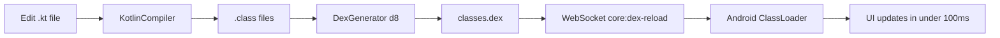
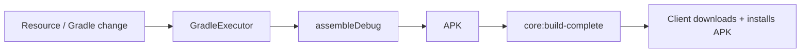

# Introduction to JetStart

**JetStart** is a blazing-fast development tool that brings **instant hot reload** to Android Jetpack Compose applications. Edit your Kotlin UI code and see the change on your physical device or web emulator in **under 100ms** — no rebuild, no reinstall, no Activity restart.

## What is JetStart?

JetStart short-circuits the traditional Gradle build process for code changes. Instead of recompiling and repackaging your entire project, it:

1. Compiles only the changed Kotlin file using `kotlinc`
2. Converts the `.class` output to DEX bytecode with Android's `d8` tool
3. Transmits the DEX patch to your device over WebSocket
4. Loads the new classes into the running app via a custom ClassLoader

The result is live code updates in under 100ms. When a change is too large for the hot reload pipeline (new dependencies, resource changes, Gradle config), it falls back to a full Gradle build automatically.

## Key Features

- **⚡ Sub-100ms Hot Reload** — Kotlin → DEX compilation pushed live to your device
- **🎨 Real Kotlin Compose** — Write actual `@Composable` functions, not configuration files
- **📱 QR Code Setup** — Connect your device by scanning a single QR code
- **📡 Completely Wireless** — No USB cables required. Works over Wi-Fi and hotspot
- **🔄 Automatic Builds** — Full Gradle fallback when hot reload isn't viable
- **🌐 Web Emulator** — Preview your Compose UI in a browser at `web.jetstart.site`
- **🛡️ Session Isolation** — Token-secured sessions; stale devices are rejected immediately
- **🛠️ CLI Tools** — Six commands cover the entire development lifecycle

:::tip No Cables, No Android Studio
JetStart is designed to be completely wireless. You don't need Android Studio, ADB over USB, or any USB drivers. Connect your phone and computer to the same Wi-Fi or hotspot, scan the QR code, and start building.
:::

## How It Works

For changes that require a full rebuild:

## Why JetStart?

### The Problem: Android Studio & Heavy IDEs
Traditional Android development is tethered to heavy IDEs and slow build systems:
- **System Weight**: Android Studio is notoriously resource-heavy, realistically requiring **16GB–32GB RAM** for a smooth experience. This is a massive barrier for developers on budget or older systems.
- **Sluggish Iteration**: The Gradle build cycle is a major productivity killer. Even for a minor UI tweak, you typically wait **30s–60s+** for Gradle to rebuild, repackage, and reinstall the APK.
- **Limited "Hot Reload"**: Android Studio's *Apply Changes* is fragile. It cannot handle structural changes (adding methods, fields, or classes) without a full Activity restart, breaking your development flow and state.
- **Complex Wireless Setup**: While wireless debugging exists, it is often finicky and prone to disconnections. Most developers still rely on USB cables for stability.
- **Installation Friction**: The initial setup requires gigabytes of downloads and complex SDK management.

### The Solution: JetStart
JetStart was built as a lightweight, "minimalist" alternative for rapid Jetpack Compose development:
- **Low-End Hardware Support**: JetStart runs effectively on as little as **4GB of RAM**. You don't need expensive hardware to build modern Android apps.
- **Run Anywhere**: Use VSCode, Sublime, Vim, or even Notepad. Freedom from "IDE tax" means your tools stay fast and responsive.
- **Sub-100ms Hot Reload**: See your changes instantly. We bypass Gradle entirely for code-only updates, pushing DEX patches directly to your device.
- **Zero Cables**: Scan a QR code and you're connected via WebSockets. No drivers, no finicky cables, no "device not found" errors.
- **Android Emulator**: Don't want to run a heavy Android Virtual Device (AVD)? Use our **Android Emulator** to preview your UI in a lightweight emulator.
- **Automated Setup**: One command (`jetstart create --full-install`) handles the entire SDK and toolchain setup for you.
- **State Preservation**: Our custom ClassLoader injects code into the running app, preserving your navigation and form state through updates.

## Who Should Use JetStart?

- **Android Developers** building Jetpack Compose apps who want faster iteration
- **Mobile Teams** tired of waiting for Gradle on every small change
- **Indie Developers** who want rapid prototyping without a heavy IDE
- **Educators** teaching Android/Compose who need live demos
- **UI/UX Designers** wanting to preview designs immediately on a real device

## What You'll Need

- Node.js 18+
- JDK 17+
- Android SDK (with `build-tools` and at least one `platform`)
- `kotlinc` accessible in your `PATH` or via `KOTLIN_HOME`
- An Android device (API 24+) or the built-in web emulator

:::tip
Don't have everything installed? Run `jetstart create my-app --full-install` and JetStart will check for and install missing dependencies interactively.
:::

## Next Steps

1. [Install JetStart](./installation.md) — set up JetStart and required dependencies
2. [Quick Start](./quick-start.md) — create your first project in 5 minutes
3. [System Requirements](./system-requirements.md) — detailed requirements

## Get Help

- [GitHub Discussions](https://github.com/dev-phantom/jetstart/discussions) — ask questions and share ideas
- [GitHub Issues](https://github.com/dev-phantom/jetstart/issues) — report bugs and request features
- [Troubleshooting](../troubleshooting/common-issues.md) — solutions to common problems

Welcome to the future of Android development! 🚀

