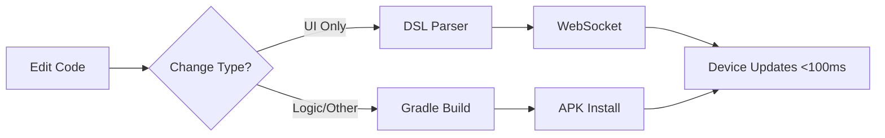

# Introduction to JetStart

**JetStart** is a blazing-fast development tool that brings **instant hot reload** to Android Jetpack Compose applications. Experience sub-100ms UI updates without rebuilding or reinstalling your app.

## What is JetStart?

JetStart revolutionizes Android development by providing two-tier hot reload system:

1. **DSL-based Hot Reload** (less than 100ms) - For UI changes in your Compose code
2. **Full Gradle Build** (fallback) - For logic changes and dependencies

This intelligent approach gives you the speed of instant reload when possible, with the reliability of full builds when needed.

## Key Features

- **⚡ Sub-100ms Hot Reload** - See UI changes instantly on your device
- **🎨 Real Kotlin Compose** - Write actual Compose code, not configuration files
- **📱 QR Code Setup** - Connect your device by scanning a QR code
- **🔄 Automatic Builds** - Smart Gradle integration with build caching
- **🌐 WebSocket Communication** - Real-time updates via WebSocket protocol
- **🛠️ CLI Tools** - Simple command-line interface with 6 powerful commands
- **🔒 Session Isolation** - Secure, isolated development sessions
- **🌍 Web Emulator** - Preview your app in the browser

## How It Works



1. You edit your Kotlin Compose code
2. JetStart detects the change type
3. For UI changes: parses to DSL and sends via WebSocket
4. For other changes: triggers full Gradle build
5. Your device updates instantly

## Why JetStart?

### Traditional Android Development
```bash
# Edit code
# Wait 30-60 seconds for Gradle build
# Wait for APK installation
# Wait for app restart
# Test your change
```

### With JetStart
```bash
# Edit code
# See changes in <100ms
# Keep testing and iterating
```

## Who Should Use JetStart?

JetStart is perfect for:

- **Android Developers** building Jetpack Compose apps
- **Mobile Teams** wanting faster iteration cycles
- **Indie Developers** needing quick prototyping
- **Educators** teaching Android development
- **UI/UX Designers** wanting live preview of designs

## What You'll Need

Before getting started with JetStart, ensure you have:

- Node.js 18+
- Android SDK
- JDK 17+
- An Android device or emulator

:::tip
Don't worry if you don't have these installed! JetStart can help you install missing dependencies with the `jetstart install-audit` command.
:::

## Next Steps

Ready to get started? Here's what to do next:

1. [Install JetStart](./installation.md) - Set up JetStart and required dependencies
2. [Quick Start](./quick-start.md) - Create your first project in 5 minutes
3. [System Requirements](./system-requirements.md) - Detailed system requirements

## Get Help

- [GitHub Discussions](https://github.com/dev-phantom/jetstart/discussions) - Ask questions and share ideas
- [GitHub Issues](https://github.com/dev-phantom/jetstart/issues) - Report bugs and request features
- [Troubleshooting](../troubleshooting/common-issues.md) - Solutions to common problems

Welcome to the future of Android development! 🚀
