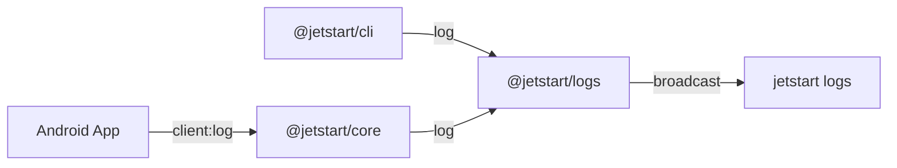

# Logs

The Logs package (`@jetstart/logs`) provides a dedicated server and CLI tools for aggregating and viewing real-time logs from your Android devices, build server, and CLI.

## Overview

The Logs package consists of two main parts:

1. **Logs Server** - A lightweight WebSocket server (default port `8767`) that acts as a central hub for all log events. It maintains a memory-efficient ring buffer of recent logs.
2. **Log Viewer** - A CLI-based viewer that connects to the Logs Server and displays formatted, color-coded logs in your terminal.

## Architecture



## Features

- **Real-time Streaming** - See logs as they happen with minimal latency.
- **Cross-Source Aggregation** - View logs from your physical device, emulator, build server, and CLI in a single stream.
- **Log Buffering** - The server stores the last 10,000 log entries, allowing you to see history when you connect.
- **Color Coding** - Different sources and log levels are visually distinguished for better readability.

## Usage

### CLI Viewing

To view logs in your terminal:

```bash
jetstart logs --follow
```

### Filtering

You can filter logs by level or source:

```bash
# Only errors from the BUILD source
jetstart logs --level error --source BUILD
```

## Programmatic Usage

You can also use the Logs package in your own TypeScript tools:

```typescript
import { LogsServer } from '@jetstart/logs';

const server = new LogsServer({ port: 8767 });
server.start();

// Listen for new logs
server.on('log', (entry) => {
    console.log(`[${entry.source}] ${entry.message}`);
});
```

## Log Entry Structure

A typical log entry follows this structure:

```typescript
interface LogEntry {
  timestamp: number;
  level: 'debug' | 'info' | 'warn' | 'error';
  source: 'CLI' | 'CORE' | 'CLIENT' | 'BUILD';
  message: string;
  metadata?: Record<string, any>;
}
```

## Related Documentation

- [CLI Reference: jetstart logs](../cli/logs.md) - Command usage details
- [Core Package](./core.md) - How the core server sends logs
- [Client App](./client.md) - How the mobile app forwards logs
